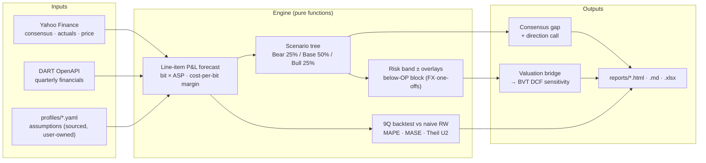

# Earnings Forecast Engine

[한국어](README.md) | **English**

Quarterly/annual forward-EPS model + consensus gap analysis + trailing 9Q backtest. Current coverage: SK Hynix (`000660.KS`). Forward window: **2026Q2–2027Q1** (seed = 2026Q1 actuals).

## Why

The static valuation tool ([business-valuation-tool](https://github.com/jiwonsea/Business-Valuation-Tool)) has 7 engines — SOTP, DCF, rNPV and more — but its growth input is a CAGR-fade assumption. This project fills the cycle of **line-item P&L forecast → consensus comparison → trailing-quarter backtest → sensitivity bridge into the BVT DCF**, turning forward-earnings analysis into a concrete artifact.

## Quickstart

```bash
git clone https://github.com/jiwonsea/earnings-forecast-engine
cd earnings-forecast-engine
pip install -r requirements.txt
cp .env.example .env   # set DART_API_KEY
python cli.py --company sk_hynix
```

Generates `reports/sk_hynix_YYYYMMDD.html` (interactive, primary) + `.md` (summary/quoting) + `.xlsx` (raw).

## How It Works



The core loop: **line-item forecast → probability-weighted scenarios → consensus gap → skill verification via 9Q backtest → BVT DCF sensitivity bridge**. If the backtest cannot beat the naive baseline, any gap claim is rejected.

## Methodology

See [docs/methodology.md](docs/methodology.md) for the full driver decomposition. Summary:

- Revenue = Σ (segment bit volume × blended ASP). SK Hynix decomposes into DRAM (HBM + DDR) and NAND.
- Margin = **cost-per-bit operating-leverage** model: `GP_margin_s = 1 − cost_per_bit_s / ASP_s`. When ASP rises faster than cost per bit, margins expand (peak); when it falls behind, they go negative (trough) — structurally capturing the memory price cycle. HBM mix enters via segment revenue weighting.
- Scenarios = Bear (25%) / Base (50%) / Bull (25%), producing a probability-weighted EPS.
- Forward window = **2026Q2–2027Q1** (rolled 2026-07-03; seed = 2026Q1 actuals — revenue KRW 52.6tn, +60% QoQ, GP 79.3%). Assumption vectors are based on TrendForce 2Q26/3Q26 contract-price outlooks + SK's 1Q26 call guidance (HBM4 ramp, capex) — sources documented in the `profiles/sk_hynix.yaml` assumptions comments.
- Backtest = trailing 9-quarter retrospective. **Non-circular**: both margins and revenue use **realized market ASPs** from `historical_drivers` (independent observations such as TrendForce) as inputs, while bit growth is the assumption under test. The company's realized revenue is used only for comparison.
- Consensus gap = difference vs Yahoo Finance `earnings_estimate` / `revenue_estimate` + directional interpretation. (⚠️ `.KS` consensus reliability is limited — Korean broker consensus integration is P1.)

## Sample Output

**Forward fan chart** — probability-weighted revenue path with Bear–Bull band, 2026Q2–2027Q1 (run of 2026-07-10):


**9Q backtest revenue error** — 2024Q1–2026Q1, per-quarter forecast error % (goal: no systematic bias):


[**▶ Interactive HTML demo**](reports/sk_hynix_20260710.html) — run of 2026-07-10, includes the opex-leverage fix + 2026Q2 forward roll (open in a browser — Plotly hover, scenario toggle, sortable tables). Markdown version with the backtest table: [`reports/sk_hynix_20260710.md`](reports/sk_hynix_20260710.md)

> Images under `docs/assets/` are stable-named copies of the latest run's PNGs — after a live re-run, overwrite them with `reports/sk_hynix_YYYYMMDD_{fan,beat_miss}.png` to refresh.

## Backtest Performance

9Q rolling backtest (2024Q1–2026Q1) on sourced-draft assumptions. **Absolute error alone cannot be judged without a reference point**, so skill metrics against a naive Random Walk (persistence) baseline are reported alongside (project rule: *"Model must beat naive-baseline error, not just hit direction"*).

| Metric | Target | Current | Reference |
|--------|--------|---------|-----------|
| Revenue MAPE | < 10% | 9.0% | vs RW revenue MAPE **17.3%** (~half) |
| EPS MAPE | < 25% | 10.4% | vs RW EPS MAPE **46.7%** (~one quarter) |
| EPS bias (signed) | \|x\| < 5% | **−3.6% ✓** | within target after tax-anchor + opex-leverage fixes (9Q) |
| MASE (revenue · EPS) | < 1 | **0.43 · 0.28** | **< 1 → beats RW (both pass)** |
| Theil U2 (revenue · EPS) | < 1 | **0.33 · 0.28** | **< 1 → beats RW (both pass)** |
| Surprise direction (N=4) | — | 100% (4/4)¹ · skill +0.54 | sign of the *deviation* vs consensus |

> The standalone "hit ratio 87.5%" from an earlier README was **removed** — in a structural up-cycle it is indistinguishable from "always up" and carries no skill signal (measured: model 87.5% **= RW 87.5%**; direction is not an edge). Magnitude-based MASE / Theil U2 are used instead. **A skill claim requires both MASE < 1 *and* Theil U2 < 1**; both revenue and EPS pass → **advantage over naive confirmed**. The systematic EPS bias entered the ±5% target via tax-anchor recalibration (0.20 → 0.164; −10.6% → −6.4%) and the opex operating-leverage fix (constant 15% → fixed KRW 990bn + variable 7.3%, `PLAN_opex_model.md`; −6.4% → −1.6%), and holds at **−3.6%** on the 9Q window that adds the supercycle quarter 2026Q1 (the EPS bridge uses per-quarter seed-implied share counts, removing fixed-share-count drift) (2026Q1's −16.3% EPS error is mostly the below-OP block, −23.7%). The largest residual volatility axis is the below-OP block (FX revaluation, one-offs — structurally unforecastable), expressed not by point-estimate fine-tuning but by a **separate risk band (±22.8%, draft) + date-tagged overlays** (`HANDOFF_block_overlay.md`). 9Q is a small sample — do not over-read point estimates. The full table is refreshed on every run in the Skill section of `reports/sk_hynix_YYYYMMDD.{md,html,xlsx}` (driven by `profiles/sk_hynix.yaml` assumptions, user-confirmed).
>
> ¹ **Indicative only (small sample, N=4).** Fixing a field-name bug in `consensus_loader`'s `earnings_history` (`period` ↔ `quarter`) plus extending the backtest window to 2026Q1 yields 4 quarters of vintage consensus (2025Q2–2026Q1). The model beat vintage consensus on both EPS level (skill_score +0.54 = 1 − model_MAE/cons_MAE) and surprise direction (4/4, including the +41.6% surprise quarter 2026Q1), but **N=4 remains statistically negligible — do not over-interpret**; this is "the metric is switched on", not proof of superiority. Expanding N (accumulating past vintages or Korean broker consensus) is follow-up work. Diagnosis and implementation: `HANDOFF_backtest_diag.md` session C / `PLAN_consensus_wiring.md`.

## Roadmap

- **P1**: extend to Samsung Electronics (`005930.KS`), Tokyo Electron (`8035.T`)
- **P1**: Korean broker consensus integration (Naver Finance, FnGuide)
- **P2**: bidirectional adapter with BVT — forecast → DCF fair-value auto-update
- **P2**: Streamlit dashboard

## AI Collaboration

This project is built as a collaboration between a human analyst and two AI tools (Claude Code · Codex CLI).

- **Human (me)**: strategy and methodology decisions, **review/confirmation/ownership of assumption values**, result interpretation, thesis, interview defense.
- **Claude Code**: market-data-sourced assumption **drafts** (with citations), **verification/QA** (catching silent failures), methodology design and handoffs, backtest non-circularity discipline.
- **Codex CLI**: function implementation, tests, refactoring.

Assumptions are drafted by AI with sources, then reviewed, confirmed, and owned by the analyst. Details and honesty standards: [docs/ai_collaboration.md](docs/ai_collaboration.md).

## Scope (honesty)

The revenue/margin **model is specific to memory semiconductors** (DRAM/HBM/NAND · bit × ASP · cost-per-bit). The pipeline, scenario framework, backtest, and methodology discipline are **reusable** — memory peers (Samsung, Micron) need little more than a new profile; non-memory names require redesigning the revenue/margin engine. This is not a "universal earnings engine" but a **memory forward model + reusable methodology and plumbing**.

## License

MIT
