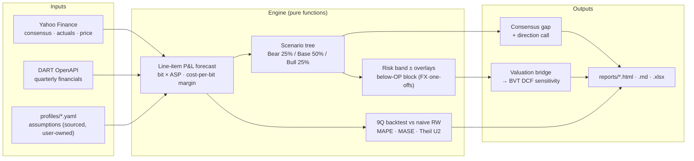
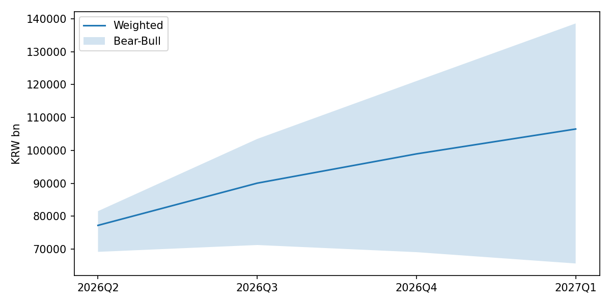
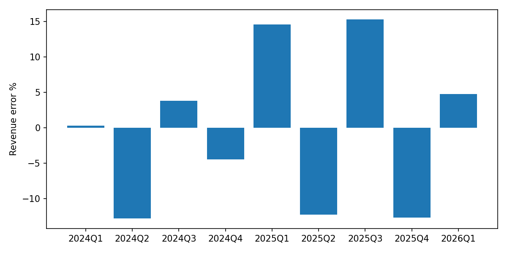

# Earnings Forecast Engine

**한국어** | [English](README.en.md)

분기·연간 EPS forward 모델 + 컨센서스 갭 분석 + 직전 9Q backtest. 현재 커버: SK하이닉스 (`000660.KS`). Forward 윈도: **2026Q2~2027Q1** (seed = 2026Q1 실적).

## Why

정적 valuation 도구([business-valuation-tool](https://github.com/jiwonsea/Business-Valuation-Tool))는 SOTP·DCF·rNPV 등 7개 엔진을 갖추고 있으나, growth는 CAGR-fade 가정 수준에 머물러 있습니다. 본 프로젝트는 **라인별 P&L 예측 → 컨센서스 비교 → 직전 분기 backtest → BVT DCF로의 sensitivity bridge** 까지의 사이클을 채워 forward earnings 분석을 산출물 단위로 만듭니다.

## Quickstart

```bash
git clone https://github.com/jiwonsea/earnings-forecast-engine
cd earnings-forecast-engine
pip install -r requirements.txt
cp .env.example .env   # DART_API_KEY 입력
python cli.py --company sk_hynix
```

`reports/sk_hynix_YYYYMMDD.html` (인터랙티브 primary) + `.md` (요약·인용용) + `.xlsx` (raw) 가 생성됩니다.

## How It Works



핵심 루프: **라인별 예측 → 시나리오 확률가중 → 컨센서스 갭 → 9Q backtest로 스킬 검증 → BVT DCF sensitivity bridge**. 백테스트가 naive baseline을 못 이기면 갭 주장은 기각됩니다.

## Methodology

자세한 드라이버 분해 로직은 [docs/methodology.md](docs/methodology.md) 참조. 요약:

- 매출 = Σ (세그먼트 bit volume × blended ASP). SK하이닉스는 DRAM(HBM + DDR)·NAND 분해.
- 마진 = **cost-per-bit operating-leverage** 모델: `GP_margin_s = 1 − cost_per_bit_s / ASP_s`. ASP가 bit당 원가보다 빠르게 오르면 마진 확장(피크), 반대면 음수(트로프) — 메모리 가격 사이클을 구조적으로 포착. HBM mix는 세그먼트 매출 가중으로 반영.
- 시나리오 = Bear(25%) / Base(50%) / Bull(25%), 확률 가중 EPS 산출.
- Forward 윈도 = **2026Q2~2027Q1** (2026-07-03 롤링; seed = 2026Q1 실적 — 매출 52.6조 +60% QoQ, GP 79.3%). 가정 벡터는 TrendForce 2Q26/3Q26 contract price 전망 + SK 1Q26 콜 가이던스(HBM4 램프·capex) 기반 — 출처는 `profiles/sk_hynix.yaml` assumptions 주석.
- Backtest = 직전 9분기 retrospective. **비순환**: 마진·매출 모두 `historical_drivers`의 **실현 시장 ASP**(TrendForce 등 독립 관측)를 입력으로 쓰고, bit growth는 가정(시험 대상). 회사 실현 매출은 비교에만 사용.
- Consensus 갭 = Yahoo Finance `earnings_estimate` / `revenue_estimate` 대비 차이 + 방향성 해석. (⚠️ `.KS` 컨센은 신뢰도 제한 — 한국 broker 컨센 통합은 P1.)

## Sample Output

**Forward fan chart** — 2026Q2~2027Q1 확률가중 매출 경로 + Bear–Bull 밴드 (2026-07-10 실행분):



**9Q backtest 매출 오차** — 2024Q1~2026Q1, 분기별 예측 오차 % (계통 편향 없음이 목표):



[**▶ 인터랙티브 HTML 데모**](reports/sk_hynix_20260710.html) — 2026-07-10 실행분, opex leverage 수정 + 2026Q2 forward-roll 반영 (브라우저로 열어주세요 — Plotly hover·scenario 토글·sortable table). 백테스트 표 포함 md: [`reports/sk_hynix_20260710.md`](reports/sk_hynix_20260710.md)

> `docs/assets/` 이미지는 최신 실행분 PNG의 고정 이름 사본 — 라이브 재실행 후 `reports/sk_hynix_YYYYMMDD_{fan,beat_miss}.png`를 덮어쓰면 갱신.

## Backtest Performance

9Q rolling backtest (2024Q1–2026Q1), sourced-draft 가정 기준. **절대 오차는 기준점이 없어 단독 판정이 불가능**하므로, naive Random Walk(persistence) 대비 skill 지표를 함께 본다 (CLAUDE.md: *"Model must beat naive-baseline error, not just hit direction"*).

| Metric | Target | 현재 | 판정 기준 |
|--------|--------|------|------|
| 매출 MAPE | < 10% | 9.0% | RW 매출 MAPE **17.3%** 대비 (약 절반) |
| EPS MAPE | < 25% | 10.4% | RW EPS MAPE **46.7%** 대비 (약 1/4) |
| EPS bias (부호) | \|값\| < 5% | **−3.6% ✓** | tax-anchor + opex leverage 수정 후 목표 충족 (9Q) |
| MASE (매출·EPS) | < 1 | **매출 0.43 · EPS 0.28** | **<1 → RW 대비 우위 (둘 다 충족)** |
| Theil U2 (매출·EPS) | < 1 | **매출 0.33 · EPS 0.28** | **<1 → RW 대비 우위 (둘 다 충족)** |
| surprise-direction (N=4) | — | 100% (4/4)¹ · skill +0.54 | 컨센서스 대비 *편차*의 부호 |

> 직전 README의 단독 "Hit ratio 87.5%"는 **제거**했다 — 구조적 상승 사이클에서 "항상 up"과 구별이 안 돼 skill 신호가 아니다 (실측: model 87.5% **= RW 87.5%**, 방향은 edge가 아님). 대신 magnitude 기준 MASE/Theil U2로 판정한다. **skill 주장은 MASE<1 *그리고* Theil U2<1일 때만**; 매출·EPS 모두 충족 → **naive 대비 우위 확인**. EPS 계통 bias는 tax-anchor 재캘리브레이션(0.20→0.164, −10.6%→−6.4%)과 opex operating-leverage 수정(상수 15% → 고정 990bn + 변동 7.3%, `PLAN_opex_model.md`; −6.4%→−1.6%)으로 목표(±5%)에 진입했고, 슈퍼사이클 분기 2026Q1을 윈도에 추가한 9Q 기준 **−3.6%**를 유지한다 (EPS 브리지는 분기별 seed-implied 주식수 사용 — 고정 주식수 드리프트 제거) (2026Q1 EPS 오차 −16.3%는 대부분 below-OP block −23.7%). 잔여 변동성의 최대 축은 below-OP block(FX 평가손익·일회성 등 구조적 예측불가 항목)으로, 점추정 미세조정 대신 **별도 리스크 밴드(±22.8% draft) + date-tagged overlay**로 표현한다 (`HANDOFF_block_overlay.md`). 9Q는 작은 표본이라 점추정 과대해석은 금물. 전체 표는 매 실행마다 `reports/sk_hynix_YYYYMMDD.{md,html,xlsx}`의 Skill 섹션에 갱신된다 (`profiles/sk_hynix.yaml` 가정 기반, 사용자 확정 대상).
>
> ¹ **참고용 (표본 부족, N=4).** `consensus_loader`의 `earnings_history` 필드명 버그(`period`↔`quarter`) 수정 + 백테스트 윈도 2026Q1 연장으로 vintage 컨센 4분기(2025Q2–2026Q1)가 측정된다. 측정 결과 model이 vintage 컨센을 EPS level(skill_score +0.54 = 1 − model_MAE/cons_MAE)·surprise 방향(4/4, 2026Q1 +41.6% 서프라이즈 분기 포함) 모두 이겼으나, **N=4는 여전히 통계적으로 무의미 수준이라 점추정 과대해석은 금물** — 우위 입증이 아니라 "지표를 켠" 단계다. N 확대(과거 �