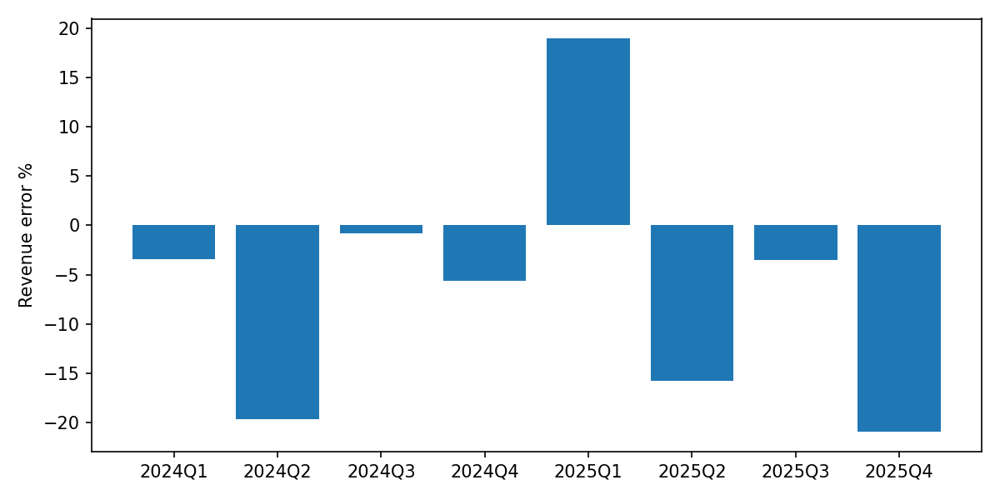

# SK하이닉스 (000660.KS) Earnings Forecast

**As of**: 2026-06-02

## Headline

- Revenue MAPE: 11.1%
- EPS MAPE: 22.1%
- Direction hit ratio: 87.5%

## Data Warnings

- yfinance .KS consensus unreliable: implied net margin >60%

## Consensus Gap

| Period | Metric | Model | Consensus | Gap % | Direction |
|---|---|---:|---:|---:|---|
| 2026Q1 | revenue | 34,845.0 |  |  | n_a |
| 2026Q1 | eps | 7,292.1 |  |  | n_a |
| 2026Q2 | revenue | 37,528.3 | 81,815.9 | -54.1% | below |
| 2026Q2 | eps | 9,832.4 | 69,422.4 | -85.8% | below |
| 2026Q3 | revenue | 40,295.9 | 96,764.0 | -58.4% | below |
| 2026Q3 | eps | 12,338.2 | 82,073.4 | -85.0% | below |
| 2026Q4 | revenue | 42,645.9 |  |  | n_a |
| 2026Q4 | eps | 14,572.9 |  |  | n_a |
| FY26 | revenue | 155,315.2 | 332,825.7 | -53.3% | below |
| FY26 | eps | 44,035.6 | 295,507.2 | -85.1% | below |

## Backtest

| Quarter | Actual Rev | Model Rev | Rev Err % | Actual EPS | Model EPS | EPS Err % | Direction |
|---|---:|---:|---:|---:|---:|---:|---|
| 2024Q1 | 12,429.6 | 12,000.6 | -3.5% | 2,788.0 | 2,518.0 | -9.7% | True |
| 2024Q2 | 16,423.3 | 13,193.8 | -19.7% | 5,983.0 | 4,151.5 | -30.6% | True |
| 2024Q3 | 17,573.1 | 17,433.1 | -0.8% | 8,344.0 | 6,639.7 | -20.4% | True |
| 2024Q4 | 19,767.0 | 18,653.6 | -5.6% | 11,614.0 | 7,913.1 | -31.9% | True |
| 2025Q1 | 17,639.1 | 20,982.4 | 19.0% | 11,756.0 | 9,075.5 | -22.8% | False |
| 2025Q2 | 22,232.0 | 18,723.7 | -15.8% | 10,135.0 | 9,094.0 | -10.3% | True |
| 2025Q3 | 24,448.9 | 23,598.9 | -3.5% | 18,242.0 | 13,629.7 | -25.3% | True |
| 2025Q4 | 32,826.7 | 25,952.2 | -20.9% | 21,909.0 | 16,262.4 | -25.8% | True |
