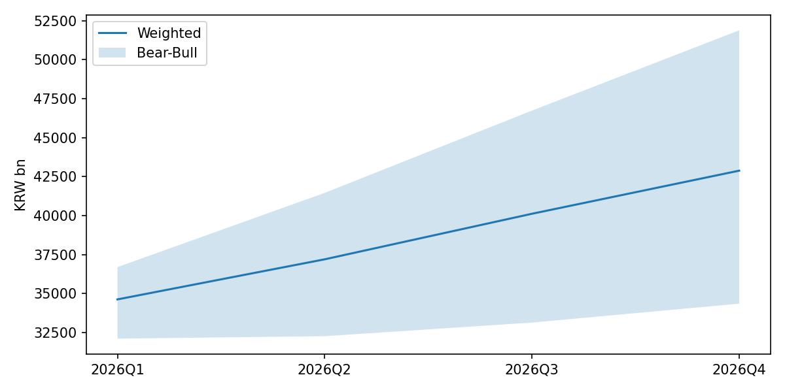
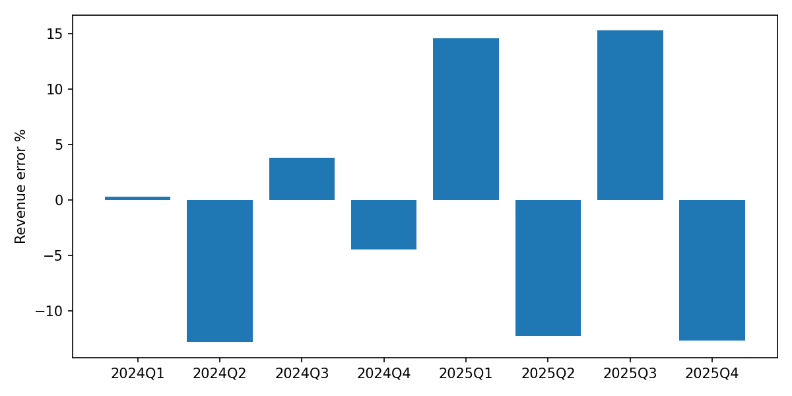

# SK하이닉스 (000660.KS) Earnings Forecast

**As of**: 2026-06-03

## Headline

- Revenue MAPE: 9.5%
- EPS MAPE: 12.6%
- Direction hit ratio: 87.5%

## Data Warnings

- yfinance .KS consensus unreliable: implied net margin >60%

## Consensus Gap

| Period | Metric | Model | Consensus | Gap % | Direction |
|---|---|---:|---:|---:|---|
| 2026Q1 | revenue | 34,845.0 |  |  | n_a |
| 2026Q1 | eps | 23,562.4 |  |  | n_a |
| 2026Q2 | revenue | 37,528.3 | 81,815.9 | -54.1% | below |
| 2026Q2 | eps | 25,981.9 | 69,422.4 | -62.6% | below |
| 2026Q3 | revenue | 40,295.9 | 96,764.0 | -58.4% | below |
| 2026Q3 | eps | 28,467.9 | 82,073.4 | -65.3% | below |
| 2026Q4 | revenue | 42,645.9 |  |  | n_a |
| 2026Q4 | eps | 30,636.3 |  |  | n_a |
| FY26 | revenue | 155,315.2 | 332,825.7 | -53.3% | below |
| FY26 | eps | 108,648.5 | 295,507.2 | -63.2% | below |

## Backtest

| Quarter | Actual Rev | Model Rev | Rev Err % | Actual EPS | Model EPS | EPS Err % | Direction |
|---|---:|---:|---:|---:|---:|---:|---|
| 2024Q1 | 12,429.6 | 12,470.5 | 0.3% | 2,788.0 | 4,031.2 | 44.6% | True |
| 2024Q2 | 16,423.3 | 14,323.2 | -12.8% | 5,983.0 | 5,883.4 | -1.7% | True |
| 2024Q3 | 17,573.1 | 18,241.1 | 3.8% | 8,344.0 | 8,448.1 | 1.2% | True |
| 2024Q4 | 19,767.0 | 18,881.4 | -4.5% | 11,614.0 | 9,362.1 | -19.4% | True |
| 2025Q1 | 17,639.1 | 20,206.1 | 14.6% | 11,756.0 | 10,041.4 | -14.6% | False |
| 2025Q2 | 22,232.0 | 19,510.7 | -12.2% | 10,135.0 | 10,519.0 | 3.8% | True |
| 2025Q3 | 24,448.9 | 28,181.6 | 15.3% | 18,242.0 | 17,738.4 | -2.8% | True |
| 2025Q4 | 32,826.7 | 28,675.5 | -12.6% | 21,909.0 | 19,029.8 | -13.1% | True |
