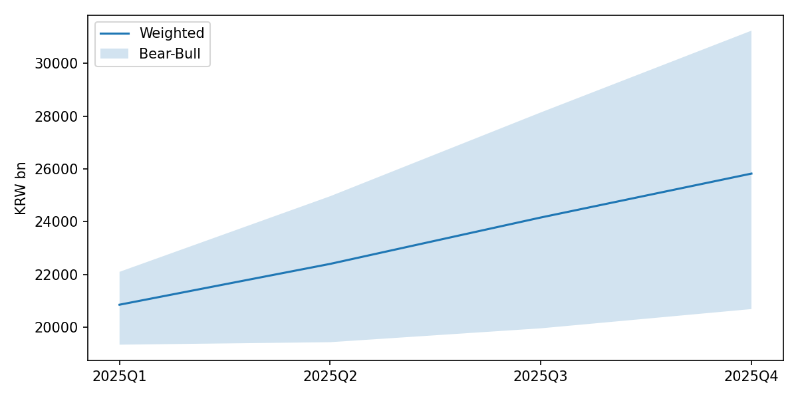
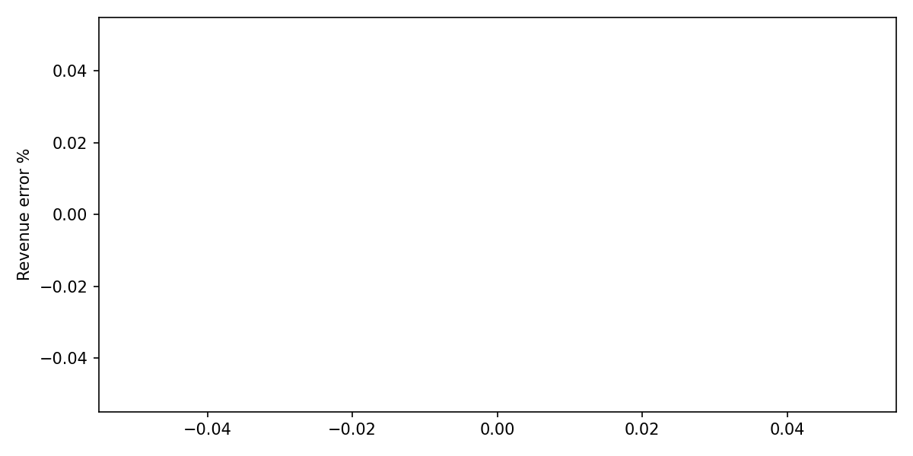

# SK하이닉스 (000660.KS) Earnings Forecast

**As of**: 2026-06-24

## Headline

- Revenue MAPE: 0.0%
- EPS MAPE: 
- Direction hit ratio (model vs RW): 0.0%

## Data Warnings

- yfinance .KS consensus unreliable: implied net margin >60%

## Consensus Gap

| Period | Metric | Model | Consensus | Gap % | Direction |
|---|---|---:|---:|---:|---|
| 2025Q1 | revenue | 20,982.4 |  |  | n_a |
| 2025Q1 | eps | 14,837.9 |  |  | n_a |
| 2025Q2 | revenue | 22,598.2 |  |  | n_a |
| 2025Q2 | eps | 16,361.2 |  |  | n_a |
| 2025Q3 | revenue | 24,264.8 |  |  | n_a |
| 2025Q3 | eps | 17,926.4 |  |  | n_a |
| 2025Q4 | revenue | 25,679.8 |  |  | n_a |
| 2025Q4 | eps | 19,291.7 |  |  | n_a |
| FY25 | revenue | 93,525.2 |  |  | n_a |
| FY25 | eps | 68,417.2 |  |  | n_a |

## Below-OP 리스크 밴드 (EPS)

> below-OP 블록(순금융손익·FX 평가·일회성)의 구조적 변동성을 EPS 점추정에 넣지 않고 별도 ±밴드로 표현 (method=mad, k=1.5, ±22.8%). bear/bull 시나리오 범위와 다른 불확실성 — 합치지 않음.

| 분기 | 하한 | 점추정 | 상한 |
|---|---:|---:|---:|
| 2025Q1 | 11,341 | 14,689 | 18,036 |
| 2025Q2 | 12,481 | 16,165 | 19,850 |
| 2025Q3 | 13,766 | 17,830 | 21,893 |
| 2025Q4 | 15,008 | 19,437 | 23,867 |

### Overlays (밸류에이션·리스크 레이어 — EPS 점추정 불반영)

| As-of | Target | Driver | Direction | Magnitude | Confidence |
|---|---|---|---|---:|---:|
| 2026-05-15 | 2026Q2 | USD/KRW 환율 평가손실 (below-OP FX) | risk_down | +0.03 | 40% |
| 2026-06-10 | 2026Q3 | UST 10Y/30Y 금리 급등 → 밸류에이션 할인율 상승 | risk_down | +0.05 | 30% |
| 2026-06-01 | 2026Q4 | Nvidia HBM 파트너 의존도 (집중 리스크) | risk_down | +0.04 | 35% |

> Overlays are surfaced as risk annotations only; fair-value/DCF consumption is delegated to engine/valuation_bridge.py (PLAN_tax_finance_overlay.md §3.0/§5).

## 밸류에이션 브리지 (FY25)

> EPS gap(모델 vs 컨센) × 탄력도 1.2 → 공정가치 delta. overlay 매크로 리스크는 별도 레이어 — EPS·공정가치 delta 점값에 미반영. 탄력도는 BVT sensitivity로 확정할 draft.

| 지표 | 값 |
|---|---:|
| 모델 FY EPS | 68,121 |
| 컨센서스 FY EPS | — |
| EPS gap | — |
| 공정가치 delta (탄력도 1.2) | — |
| overlay 리스크 점수 (매크로, 별도) | -0.041 (n=3) |

> 컨센서스 FY EPS 부재 — fair-value delta 보류.

## Backtest

| Quarter | Actual Rev | Model Rev | Rev Err % | Actual EPS | Model EPS | EPS Err % | Direction |
|---|---:|---:|---:|---:|---:|---:|---|
